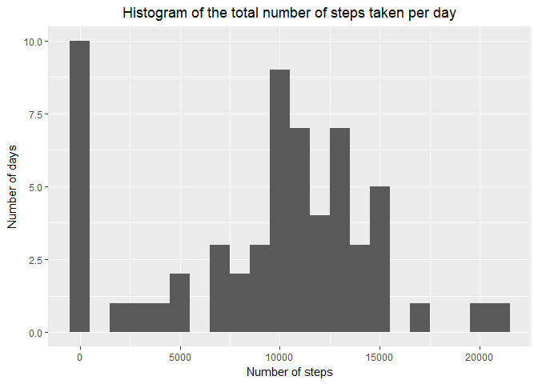
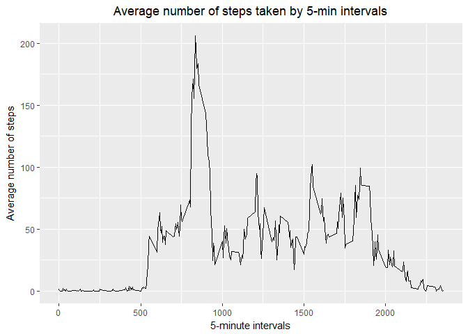
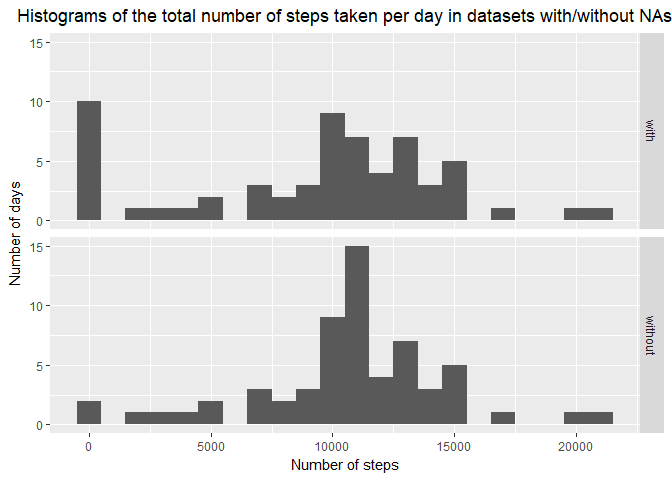
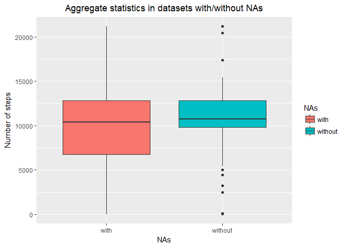
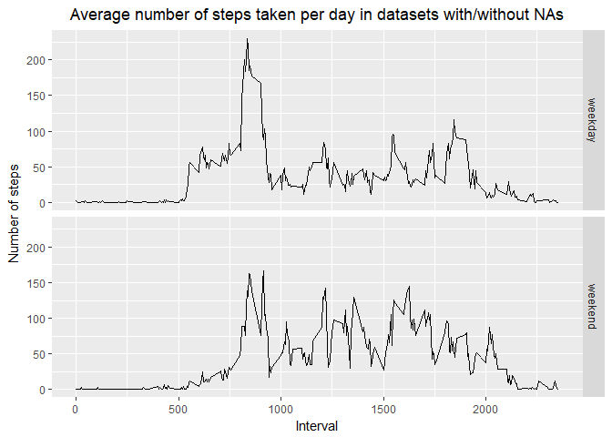

## Loading and preprocessing the data

1. Load the data (i.e. \color{red}{\verb|read.csv()|}read.csv())
2. Process/transform the data (if necessary) into a format suitable for your analysis


```r
library(dplyr, warn.conflicts = FALSE, quietly = TRUE)
```

```
## Warning: package 'dplyr' was built under R version 3.4.3
```

```r
library(plyr, warn.conflicts = FALSE, quietly = TRUE)
```

```
## Warning: package 'plyr' was built under R version 3.4.3
```

```
## -------------------------------------------------------------------------
```

```
## You have loaded plyr after dplyr - this is likely to cause problems.
## If you need functions from both plyr and dplyr, please load plyr first, then dplyr:
## library(plyr); library(dplyr)
```

```
## -------------------------------------------------------------------------
```

```r
library(lubridate, warn.conflicts = FALSE, quietly = TRUE)
```

```
## Warning: package 'lubridate' was built under R version 3.4.4
```

```r
library(data.table, warn.conflicts = FALSE, quietly = TRUE)
```

```
## Warning: package 'data.table' was built under R version 3.4.4
```

```r
library(ggplot2, warn.conflicts = FALSE, quietly = TRUE)
```

```
## Warning: package 'ggplot2' was built under R version 3.4.2
```


```r
dataset <- fread('activity.csv')
dataset[, date := strptime(date, "%Y-%m-%d")]
```

```
## Warning in strptime(date, "%Y-%m-%d"): POSIXlt column type detected and
## converted to POSIXct. We do not recommend use of POSIXlt at all because it
## uses 40 bytes to store one date.
```

## What is mean total number of steps taken per day?

For this part of the assignment, you can ignore the missing values in the dataset.

1. Calculate the total number of steps taken per day
2. Make a histogram of the total number of steps taken each day
3. Calculate and report the mean and median of the total number of steps taken per day


```r
table_1 <- dataset[, list(steps = sum(steps, na.rm = TRUE)), by = date] 

ggplot(table_1, aes(steps))+ geom_histogram(binwidth = 1000) +
    ggtitle("Histogram of the total number of steps taken per day") +
    theme(plot.title = element_text(hjust = 0.5)) +
    labs(x = "Number of steps", y = "Number of days")
```

<!-- -->

```r
mean(table_1$steps)
```

```
## [1] 9354.23
```

```r
median(table_1$steps) 
```

```
## [1] 10395
```

## What is the average daily activity pattern?

1. Make a time series plot (i.e. type = "l") of the 5-minute interval (x-axis) and the average number of steps taken, averaged across all days (y-axis)
2. Which 5-minute interval, on average across all the days in the dataset, contains the maximum number of steps?


```r
table_2 <- dataset[, list(steps = mean(steps, na.rm = TRUE)), by = interval]

ggplot(table_2, aes(x = interval, y = steps)) + geom_line() +
    ggtitle("Average number of steps taken by 5-min intervals") +
    theme(plot.title = element_text(hjust = 0.5)) +
    labs(x = "5-minute intervals", y = "Average number of steps")
```

<!-- -->

```r
table_2[steps == max(steps), .(steps, interval)]
```

```
##       steps interval
## 1: 206.1698      835
```

## Imputing missing values

1. Calculate and report the total number of missing values in the dataset (i.e. the total number of rows with NAs)
2. Devise a strategy for filling in all of the missing values in the dataset. The strategy does not need to be sophisticated. For example, you could use the mean/median for that day, or the mean for that 5-minute interval, etc.
3. Create a new dataset that is equal to the original dataset but with the missing data filled in.
4. Make a histogram of the total number of steps taken each day. Calculate and report the mean and median total number of steps taken per day. Do these values differ from the estimates from the first part of the assignment? What is the impact of imputing missing data on the estimates of the total 
daily number of steps?


```r
# number of NAs in each column
colSums(is.na(dataset))
```

```
##    steps     date interval 
##     2304        0        0
```

```r
# function for imputing the mean for 5-minute interval
impute.mean <- function(x) replace(x, is.na(x), mean(x, na.rm = TRUE))

# new dataset witout NAs
dataset_2 <- data.table(ddply(dataset, ~ interval, transform, steps = impute.mean(steps)))

table_3 <- dataset_2[, list(steps = sum(steps)), by = date]

# new dataset for comparing mean and median of datasets with/without NAs
plot.data <- rbind(table_1[, NAs:= "with"], table_3[, NAs:= "without"])

ggplot(plot.data, aes(steps)) + geom_histogram(binwidth = 1000) +
    facet_grid(NAs  ~ .) +
    ggtitle("Histograms of the total number of steps taken per day in datasets with/without NAs") +
    theme(plot.title = element_text(hjust = 0.5)) +
    labs(x = "Number of steps", y = "Number of days")
```

<!-- -->

```r
# comparison table for datasets with/without NAs
plot.data[, list(mean = mean(steps), median = median(steps) ), by = NAs]
```

```
##        NAs     mean   median
## 1:    with  9354.23 10395.00
## 2: without 10766.19 10766.19
```

```r
ggplot(plot.data, aes(x = NAs, y = steps, fill = NAs)) + geom_boxplot() +
    ggtitle("Aggregate statistics in datasets with/without NAs") +
    theme(plot.title = element_text(hjust = 0.5)) +
    labs(y = "Number of steps")
```

<!-- -->

## Are there differences in activity patterns between weekdays and weekends?

1. Create a new factor variable in the dataset with two levels – “weekday” and “weekend” indicating whether a given date is a weekday or weekend day.
2. Make a panel plot containing a time series plot (i.e. type = "l") of the 5-minute interval (x-axis) and the average number of steps taken, averaged across all weekday days or weekend days (y-axis). 


```r
Sys.setlocale("LC_TIME", "English")
```

```
## [1] "English_United States.1252"
```

```r
dataset_2[, weekday:= weekdays(date) ]
dataset_2[, weekday:= ifelse(weekday %in% c("Monday", "Tuesday", "Wednesday",
                                            "Thursday", "Friday"), "weekday",
                             "weekend") ]

table_4 <- dataset_2[, list(steps = mean(steps)), by = .(interval, weekday)]

ggplot(table_4, aes(x = interval, y = steps)) +
    geom_line() + facet_grid(weekday  ~ .) +
    ggtitle("Average number of steps taken per day in datasets with/without NAs") +
    theme(plot.title = element_text(hjust = 0.5)) +
    labs(y = "Number of steps", x = "Interval")
```

<!-- -->
